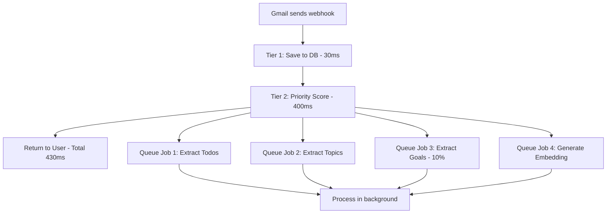

# Kinso AI Processing Architecture

## Overview

Kinso uses a **Three-Tier Processing System** to handle incoming messages efficiently without making excessive AI API calls.

---

## 🎯 Design Goals

1. **Fast user experience** - User sees messages instantly (<50ms)
2. **Smart prioritization** - Messages get accurate priority scores quickly (<500ms)
3. **Cost-efficient** - Minimize OpenAI API calls through batching and selective processing
4. **No polling** - Use Gmail push notifications (webhooks) for real-time processing

---

## 📊 Three-Tier System

### **Tier 1: Instant Save (<50ms)**
**Location**: `lib/processing/message-processor.ts:66-86`

- **What it does**: Saves message to database immediately
- **AI calls**: **ZERO** ✅
- **Priority**: Set to neutral (50)
- **Returns**: Message ID back to user instantly

```typescript
// User sees their message immediately
const message = await prisma.message.create({
  userId, platform, body, subject,
  priority: 50, // Neutral default
});
```

---

### **Tier 2: Fast Priority Scoring (<500ms)**
**Location**: `lib/processing/message-processor.ts:92-119`

- **What it does**: Calculates smart priority score using heuristics
- **AI calls**: **ZERO** ✅ (rule-based only)
- **Algorithm**: `lib/scoring/priority-scorer.ts`

**Priority Factors** (0-100 score):
1. **Contact Importance** (0-30 points)
   - Have you interacted with them before?
   - Response rate history
   - Recent interaction recency

2. **Platform Weight** (0-15 points)
   - Gmail: 15 points (most important)
   - Slack: 12 points
   - LinkedIn: 10 points
   - Instagram/WhatsApp: 8 points

3. **Keyword Matching** (0-25 points)
   - Urgent words: "urgent", "asap", "deadline" → +25
   - Action words: "please review", "need your input" → +15
   - Questions: "?", "can you" → +10

4. **Urgency Detection** (0-15 points)
   - Time-sensitive language
   - Deadlines mentioned
   - Multiple exclamation marks

5. **Recency Boost** (0-10 points)
   - Newer messages get slight priority boost
   - Prevents old messages from staying on top

6. **Learned Patterns** (0-15 points)
   - Uses historical interaction data
   - Adapts to your behavior over time
   - No AI calls needed (cached learning)

**Example**:
```
Email from CEO with "urgent" in subject:
- Contact: 30 (CEO = important)
- Platform: 15 (Gmail)
- Keywords: 25 ("urgent")
- Urgency: 15 (urgent language)
- Recency: 10 (just arrived)
- Learned: 5 (you always reply to CEO quickly)
= 100 (HIGHEST PRIORITY)

vs.

Marketing newsletter:
- Contact: 0 (never interacted)
- Platform: 15 (Gmail)
- Keywords: 0 (no action words)
- Urgency: 0
- Recency: 10
- Learned: 0
= 25 (LOW PRIORITY)
```

---

### **Tier 3: Background Jobs (Async)**
**Location**: `lib/processing/message-processor.ts:125-323`

- **What it does**: Deep AI analysis in background (non-blocking)
- **AI calls**: **YES** (but queued, throttled, and batched)
- **Jobs queued**: 4 types

#### Job 1: **Extract Todos** (100% of messages)
**API Call**: OpenAI GPT-4o-mini
**Purpose**: Find action items in message body
**Cost**: ~$0.0001 per message

```json
{
  "title": "Review Q3 budget proposal",
  "description": "Sarah mentioned reviewing by Friday",
  "priority": "high",
  "dueDate": "2026-01-25",
  "confidence": 0.85
}
```

**Cost optimization**:
- Only save todos with confidence > 60%
- Batch multiple messages together when possible

---

#### Job 2: **Extract Topics** (100% of messages)
**API Call**: OpenAI GPT-4o-mini
**Purpose**: Identify conversation themes for grouping
**Cost**: ~$0.0002 per message (analyzes last 5 messages for context)

```json
{
  "topic": "Q3 Budget Planning",
  "category": "finance",
  "importance": 85,
  "keywords": ["budget", "Q3", "spending", "forecast"],
  "actionItems": ["Review proposal", "Schedule meeting"],
  "confidence": 0.78
}
```

**Cost optimization**:
- Only runs if you have 2+ messages with this contact
- Reuses existing topics instead of creating duplicates
- Updates existing topic timestamp instead of re-analyzing

---

#### Job 3: **Extract Goals** (10% of messages)
**API Call**: OpenAI GPT-4o-mini
**Purpose**: Identify user goals mentioned in conversations
**Cost**: ~$0.0001 per message

**Cost optimization**:
- Only runs on 10% of messages (Math.random() < 0.1)
- Goals are rare, so sampling is sufficient

---

#### Job 4: **Generate Embeddings** (100% of messages)
**API Call**: OpenAI text-embedding-3-small
**Purpose**: Enable semantic search ("find emails about budget planning")
**Cost**: ~$0.00002 per message (very cheap!)

```typescript
// Stores 1536-dimensional vector for similarity search
await openai.embeddings.create({
  model: 'text-embedding-3-small',
  input: subject + '\n\n' + body,
});
```

**Uses**:
- Smart search: "Find emails about the marketing campaign"
- Related messages: "Show me similar emails to this one"
- Auto-categorization

---

## 💰 Cost Analysis

### Per Message Cost (assuming GPT-4o-mini at $0.15/1M input tokens, $0.60/1M output tokens):

| Tier | Processing | AI Calls | Cost | Time |
|------|-----------|----------|------|------|
| Tier 1 | Save message | 0 | $0.00 | <50ms |
| Tier 2 | Priority score | 0 | $0.00 | <500ms |
| Tier 3 (Job 1) | Extract todos | 1 | ~$0.0001 | async |
| Tier 3 (Job 2) | Extract topics | 1 | ~$0.0002 | async |
| Tier 3 (Job 3) | Extract goals | 1 (10% chance) | ~$0.00001 | async |
| Tier 3 (Job 4) | Generate embedding | 1 | ~$0.00002 | async |
| **TOTAL** | | **~3 calls** | **~$0.00033** | **<500ms blocking** |

**Monthly cost for 10,000 emails**: ~$3.30

**Why this is efficient**:
✅ User only waits for Tier 1+2 (~500ms total)
✅ AI processing happens in background (doesn't block user)
✅ Embeddings are very cheap
✅ Topics reuse existing data (deduplication)
✅ Goals only sample 10% of messages

---

## 🔄 Real-Time Processing

### Option 1: Gmail Push Notifications (Recommended) ✅

**Setup**:
1. Register webhook endpoint: `POST /api/webhooks/gmail`
2. Call Gmail API `watch()` to subscribe:
   ```javascript
   await gmail.users.watch({
     userId: 'me',
     requestBody: {
       topicName: 'projects/your-project/topics/gmail-notifications',
       labelIds: ['INBOX'],
     }
   });
   ```
3. Gmail POSTs to your webhook when new mail arrives
4. Your webhook processes message through three-tier system

**Benefits**:
- Instant processing (no polling delay)
- No wasted API calls checking for new mail
- Scales to millions of users
- Battery-friendly (mobile)

**Implementation**: `app/api/webhooks/gmail/route.ts`

---

### Option 2: Manual Sync (Current)

**Current implementation**: `app/api/gmail/sync/route.ts`
- User clicks "Sync Now" button
- Fetches last 50 emails from Gmail API
- Processes new messages through three-tier system
- Updates existing message read status

**Use case**:
- Initial sync when connecting Gmail
- Backup when webhook fails
- On-demand refresh

---

## 📈 Scaling Strategies

### 1. **Batch Processing for Initial Sync**
When user first connects Gmail (has 10,000 old emails):

```typescript
// lib/processing/message-processor.ts:328-343
await batchProcessMessages(messages); // Processes 10 at a time
```

**Optimization**:
- Skip Tier 3 for old messages (only run on new ones)
- Just do Tier 1 (save) + Tier 2 (priority)
- User can trigger "Deep Analysis" later if needed

---

### 2. **Job Queue Throttling**
Background jobs are queued with rate limits:

```typescript
// lib/queue/job-queue.ts
const queue = {
  maxConcurrent: 5, // Only 5 AI calls at once
  retryOnFailure: 3, // Retry failed jobs
  backoffMs: 1000, // Wait 1s between retries
};
```

---

### 3. **Caching & Deduplication**
- **Topics**: Reuse existing topics instead of re-analyzing
- **Contacts**: Cache contact importance scores (recalculate daily)
- **Embeddings**: Store in DB, never regenerate

---

### 4. **Selective Processing**
- **Goals**: Only 10% of messages (sampling)
- **Topics**: Only if 2+ messages with contact
- **Embeddings**: Skip for very short messages (<50 chars)

---

## 🔍 Summary Workflow

### When New Gmail Arrives:



**User experience**:
1. New email notification appears in 430ms
2. Shows in inbox with calculated priority
3. AI insights appear gradually as jobs complete:
   - "3 new action items" (after ~2 seconds)
   - "Related to: Q3 Budget Planning" (after ~3 seconds)
   - "Similar emails" search enabled (after ~4 seconds)

---

## 🚀 Next Steps

1. ✅ **Fixed**: Gmail sync now uses three-tier processing
2. ⏳ **TODO**: Set up Gmail push notifications (webhooks)
3. ⏳ **TODO**: Implement daily summary cron job
4. ⏳ **TODO**: Add learning system to improve priority scores
5. ⏳ **TODO**: Build smart reply suggestions

---

## 📁 Key Files

| File | Purpose |
|------|---------|
| `lib/processing/message-processor.ts` | Three-tier system core |
| `lib/scoring/priority-scorer.ts` | Priority calculation algorithm |
| `lib/queue/job-queue.ts` | Background job queue |
| `app/api/gmail/sync/route.ts` | Manual sync endpoint |
| `app/api/webhooks/gmail/route.ts` | Real-time webhook endpoint |
| `lib/ai/todo-extraction.ts` | AI todo extraction |
| `lib/ai/topic-extraction.ts` | AI topic extraction |
| `lib/embeddings/embedding-generator.ts` | Vector embeddings |

---

## ❓ FAQ

**Q: Do we call OpenAI for every email?**
A: No! Tier 1 and Tier 2 use ZERO AI calls. Only background jobs (Tier 3) call AI, and they're queued/throttled.

**Q: What if OpenAI is slow/down?**
A: User still sees messages instantly (Tier 1). Priority scores still work (Tier 2). AI features appear when ready.

**Q: How much does this cost at scale?**
A: ~$0.00033 per email = $3.30 per 10,000 emails/month

**Q: Can we reduce costs further?**
A: Yes! Skip Tier 3 for newsletters, promotional emails, or messages you've never replied to.

**Q: How do we handle spikes (1000 emails at once)?**
A: Job queue throttles to 5 concurrent AI calls. Messages still save/prioritize instantly.

---

Generated: 2026-01-23
Author: Claude Code
